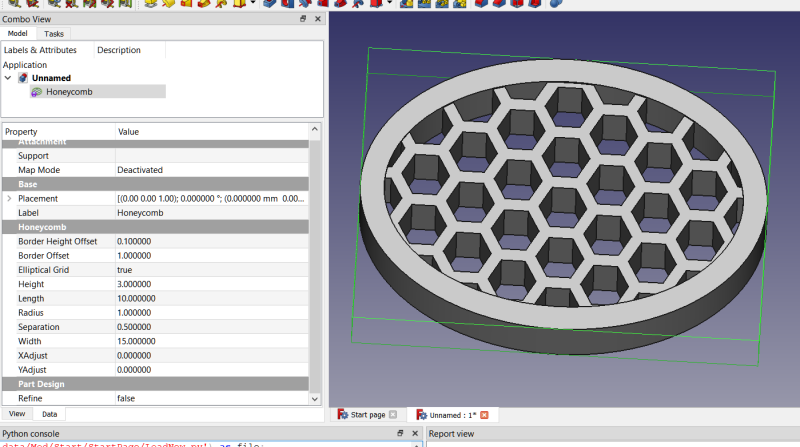
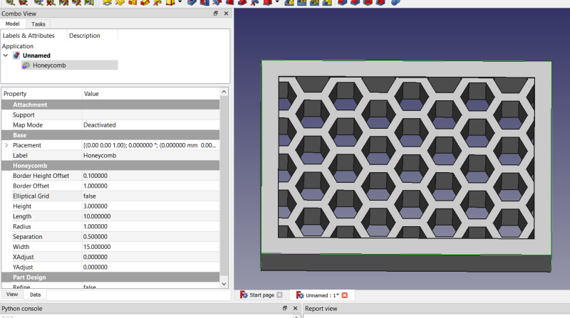

# Honeycomb macro
Honeycomb macro for FreeCAD, creates parametric honeycomb feature python object compatible in Part Design.  It can optionally include a border, either elliptical in form or rectangular, offset inwards or outwards.  The object created can be used inside a Part Design body or outside of Part Design.

 
 
 

## Toolbar Icon
 <a href="Honeycomb.svg">Download</a> the toolbar Icon. 

## Installation
Not yet available in the addon manager.  Place the Honeycomb.FCMacro file into your macro folder.  On first run it offers to create another file: honeycomb.py.  The .py file is needed in order for the Honeycomb objects to be parametric after restarting FreeCAD and opening a document containing one of the objects.

## Usage
Run the macro to create the Honeycomb object with default settings.  If there is an active Part Design Body in the document it places itself into the Body.  Otherwise it is placed in the document, but not in the Body.  You can drag/drop into the Body if you want to use it in that manner.  The Honeycomb objects are attachable.  When using in Part Design and you wish to attach to a previous feature, be sure to make the Honeycomb invisible and the previous feature you want to attach to visible.  That way, you are not attempting to attach the Honeycomb to itself.

## Properties
Like all feature python objects, Honeycomb objects have properties that can be modified to change them.
### Honeycomb
In this section are the properties related to the Honeycomb objects.
#### Border Height Offset (float)
Default: 0.1 (mm).  This defines the height of the border, if any.  It is added to the Height property.  If this is zero, then the border height is the same as the grid height.  This is included because for some reason the Refine property doesn't remove all the extraneous edges, so by setting the border height slightly higher we get a better appearance.  Note: in all cases the bottom of the border will be at the same z-coordinate as the grid, so if you are 3D printing there will be no need for support if that side is down.
#### Border Offset (float)
Default 1.0, which creates a border and offsets it 1mm from the grid.  Set this to zero if you do not want a border.  Set it to a negative value if you want the border to offset inwards.
#### Elliptical Grid (boolean)
Default: True.  If True, and if Border Offset is not zero, you get an oval-shaped elliptical border.  If False you get a rectangular border.  The Width and Height properties of the rectangular grid pull double duty as major and minor diameters of the oval grids.
#### Height (float)
Default: 3mm.  The extruded height of the grid on the z-axis.
#### Length (float)
Default: 10 (mm).  This is the size of the grid on the y-axis. It is the minor/major diameter for oval-shaped elliptical grids and the length of rectangular grids.
#### Radius (float)
Default 1 (mm).   This is the circumradius of the individual hexagons that make up the grid.  The larger the circumradius the fewer hexagons are needed for a given size, and the better the performance of your PC.  It is a good idea to set this temporarily to a higher value during modeling, and then setting to the final value as the last step for improved efficiency / productivity.
#### Separation (float)
Default 0.5 (mm).  The distance between hexagons in the grid.  It is the thickness of a given wall as measured along the perpendicular of 2 parallel edges.
#### Width (float)
Default: 15 (mm).  The width of the grid on the x-axis.  It is the diameter on that axis for oval-shaped elliptical grids and the width on that axis for rectangular grids.
#### XAdjust (float)
#### YAdjust (float)
Default: 0.  These can be used to adjust the hexagons within the grid, for example if you want a more symmetric grid or if you don't like the way the hexagons on the edge are attached to the border.  Experiment with this property to see the effect.

#### Changelog
##### 0.2021.10.22.rev2
Ensure on deletion the next feature in the Part Design body has its BaseFeature correctly reassigned to the object now in front of it.
##### 0.2021.10.22
Initial upload
